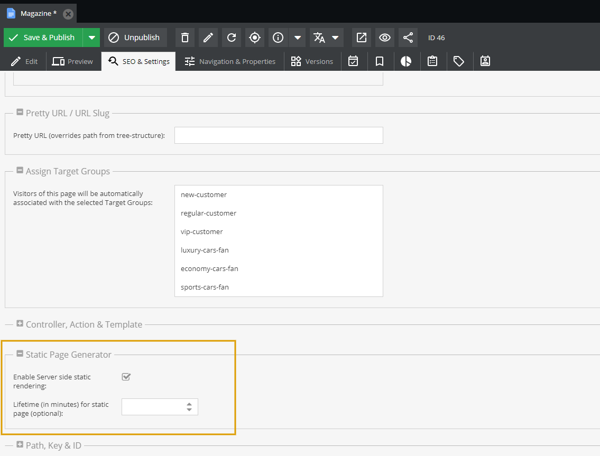

# Static Page Generator
Pimcore offers a Static Page Generator service, which is used to generate HTML pages from Pimcore documents. This generator service works by taking a Pimcore document with content and templates and renders them into a full HTML page, that can served directly from the server without the intervention of templating engine.

## Enable Static Page generator for a Document
To enable automatic static page generation on document save or by CLI command, go to Document -> Settings -> Satic Page Generator.


Mark enable checkbox and define optional lifetime for static pages (which regenerates static page after lifetime) and save document.

Once, the static page generator is enabled, the document icon changes to grey icon(as below) and last generated information is displayed on document detail view.


In addition, if you are using default local storage for static pages, then make sure your project `.htaccess` has this below section, which is responsible for looking up static page before passing to templating engine. 
```
# static pages
RewriteCond %{REQUEST_METHOD} ^(GET|HEAD)
RewriteCond %{QUERY_STRING}   !(pimcore_editmode=true|pimcore_preview|pimcore_version)
RewriteCond %{DOCUMENT_ROOT}/var/tmp/pages%{REQUEST_URI}.html -f
RewriteRule ^(.*)$ /var/tmp/pages%{REQUEST_URI}.html [PT,L]
```

## Processing
Once the static generator option is enabled, Pimcore generates static pages on following actions:
 - First request to the page, after updating and saving the document in admin.
 - Maintenance job
 - CLI command
 
In background, maintenance job takes care of generating static pages for documents on regular intervals. However, you can also use CLI command to generate static pages on demand:
  `php bin/console pimcore:generate-static-pages`
 
 also, you can filter the documents by parent path, which should processed for static generation:
 `php bin/console pimcore:generate-static-pages -d /en/Magazine`
 
## Storage
By default, Pimcore stores the generated HTML pages on local path: `'document_root/public/var/tmp/pages'`.

It is possible to customize the local storage path for static pages by defining Flysystem config in config.yaml:
```yaml
flysystem:
    storages:
        # and add directory_visibility config option to the storages
        pimcore.document_static.storage:
            # Storage for generated static document pages, e.g. .html files generated out of Pimcore documents
            # which are then delivered directly by the web-server
            adapter: 'local'
            visibility: public
            options:
                directory: '%kernel.project_dir%/public/var/tmp/pages'
```

## Static Page Generate Router
In case, you are using custom remote storage for static pages and need to serve pages from this remote location, then you would need to enable the static page router with following configuration in config.yaml:

```yaml
pimcore:
    documents:
        static_page_router:
            enabled: true
            route_pattern: '@^/(en/Magazine|de/Magazin)@'
```

| config         | Description                                                   |
|----------------|---------------------------------------------------------------|
| enabled        | Set it true to enable Static Page Router                      |
| route_pattern | Regular expression to match routes for static page rendering  |